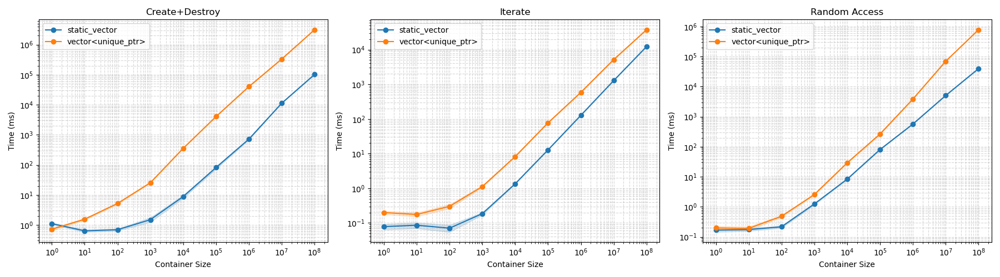

# static\_vector vs vector\<unique\_ptr> Benchmark

You can read more about **`static_vector`** [here](https://core-n.de/devblog/static_vector/).

A tiny benchmark suite that compares the performance of a hand‑rolled **`static_vector<T>`** (a fixed‑capacity, contiguous container) against a standard **`std::vector<std::unique_ptr<T>>`** when storing a non‑copyable, non‑movable `Dummy` type.

The benchmark measures three common patterns:

| Metric               | Description                                                                            |
| -------------------- | -------------------------------------------------------------------------------------- |
| **Create + Destroy**  | Time to allocate, construct every element, then destruct and deallocate the container. |
| **Iterate**          | Sequentially traverse the container with a range‑based `for` loop (read‑only).          |
| **Random Access**    | Access elements through an index array filled with uniform random indices.             |

For each metric the program reports the **mean** and a **95 % confidence interval** (CI) across configurable trial runs.

---

## Requirements

| Tool             | Version & Notes                                                                                                                   |
| ---------------- | --------------------------------------------------------------------------------------------------------------------------------- |
| **C++ compiler** | *C++23* support is required for `<print>` and deducing‑this function syntax.<br>‒ **GCC 14+** or **Clang 18+** are known to work. |

---

## Building the Benchmark

```bash
$ g++ -std=c++23 -O3 -march=native -o benchmark main.cpp
```

> Feel free to swap in `clang++` or adjust optimisation flags for your platform.

---

## Running

### Human‑readable table

```bash
$ ./benchmark
```

### CSV output (for plotting)

```bash
$ ./benchmark --csv > results.csv
```

The program benchmarks the following container sizes (elements):

```
1, 10, 100, 1 000, 10 000, 100 000, 1 000 000, 10 000 000, 100 000 000
```

*Each measurement is repeated **100** times by default; edit `trials` in `main.cpp` if you need a different sample size.*

> **Note**  The helper `clean_cache()` function allocates ≈17 MiB and scribbles pseudo‑random data between runs to reduce cache‑warm effects. Make sure your system does not have more than 17MiB cache.

---

## Plotting Results

```bash
$ python plot.py --filename results.csv
```

The script produces **`benchmark_blog_plot.png`**—a three‑panel log‑log plot with shaded 95 % CIs.
On my system it looks like this:


